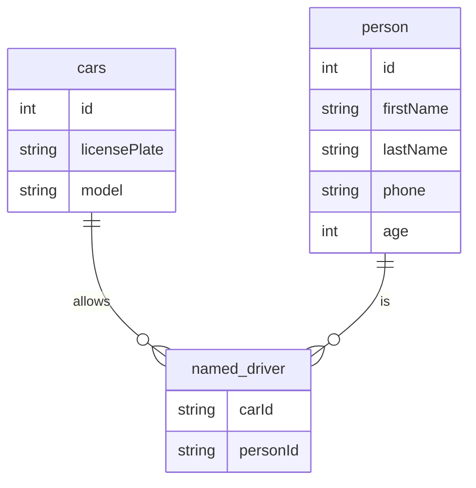

# PHP Developer Test

Clone this repository and complete the exercises on the test_* files.

You are allowed to google for documentation, but you are not allowed to copy and paste code or use ChatGPT.

## test_1.php

- Read the code laudably and explain the relevant concepts.
- What is the output of the code? Explain why.

## test_2.php

- What will be the output? why?
- How you can modify it to print "1 x 3 x 5"

## test_3.php

Using the API https://catfact.ninja/breeds and guzzle, print a sorted list of cat breeds.

## test_4.html

Follow the instructions on the file.

## test_5.sql

- Create the tables and relationships described in the diagram above.
- Write a query to:
  - get the list of cars with their named drivers.
  - get the list of cars without named drivers.
  - get the named drivers of the car with license 123.
  - get the list of the newest car per model. Order the list by model.
- Add indexes to the tables based on the queries above.

